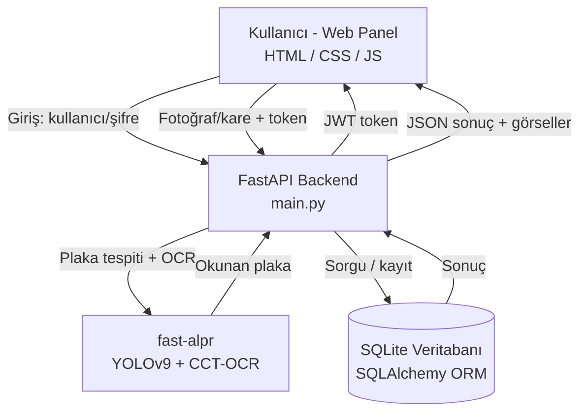

# 🅿️ Otopark Plaka Tanıma Sistemi
 
Araç plakasını kameradan veya fotoğraftan otomatik okuyup, aracın kayıtlı olup olmadığını kontrol eden ve giriş iznini yöneten web tabanlı bir otopark sistemi. Kapalı/özel otoparklar (site, kurum, tesis) için tasarlanmıştır. Rol bazlı kullanıcı girişi, canlı kamera ile otomatik plaka tanıma, raporlama ve kayıt yönetimi içerir.
 
## 🎯 Ne Yapar?
 
- **Canlı kamera ile otomatik tanıma:** Kamera sürekli taranır, araç plakası görününce otomatik okunur ve işlenir (manuel tetikleme gerekmez). Fotoğraf yükleyerek de çalışır.
- **Giriş kontrolü:** Okunan plaka kayıtlı (izinli) araçlar listesinde mi diye bakar; kayıtlıysa giriş izni verir, değilse reddeder.
- **Akıllı tekrar engeli:** Aynı araç kamera önünde beklerken bir kez loglanır (plaka bazlı zaman penceresi), farklı araçlar anında işlenir.
- **Plaka doğrulama:** Türk plaka formatına uymayan hatalı okumalar filtrelenir.
- **Kayıt yönetimi (CRUD):** Kayıtlı araçları ekleme, listeleme, düzenleme ve silme.
- **Loglama ve raporlama:** Her giriş denemesi zaman damgasıyla kaydedilir; plakaya göre arama, tarih-saat aralığı filtresi, plaka bazlı geçmiş görüntüleme ve renkli Excel (.xlsx) rapor indirme.
- **İstatistik özeti:** Kayıtlı araç sayısı, günlük toplam giriş, izinli/yetkisiz sayıları.
- **Rol bazlı kimlik doğrulama:** JWT tabanlı oturum ve bcrypt ile hash'lenmiş şifreler. İki rol: **Yönetici** (tüm yetkiler) ve **Görevli** (yalnızca izleme ve giriş kontrolü).
## 🛠️ Kullanılan Teknolojiler
 
| Katman | Teknoloji |
|--------|-----------|
| Plaka Tanıma | fast-alpr (YOLOv9 plaka tespiti + CCT tabanlı OCR) |
| Model Çalıştırma | ONNX Runtime |
| Backend | Python, FastAPI |
| Veritabanı | SQLite + SQLAlchemy (ORM) |
| Kimlik Doğrulama | JWT (PyJWT) + bcrypt |
| Görüntü İşleme | Pillow |
| Raporlama | openpyxl (Excel çıktısı) |
| Arayüz | HTML, CSS, JavaScript (canlı kamera: getUserMedia API) |
 
## 🏗️ Mimari
 

 
**Akış:** Kullanıcı giriş yapar ve bir JWT token alır → panelden kamera/fotoğraf ile plaka gönderir → FastAPI token'ı doğrular, fast-alpr plakayı okur → SQLite'ta kayıtlı mı diye kontrol edilir → sonuç ve giriş kaydı panele döner.
 
## 🚀 Kurulum ve Çalıştırma
 
```bash
# Depoyu klonlayın
git clone https://github.com/lgncelal/otopark-plaka-sistemi.git
cd otopark-plaka-sistemi
 
# Sanal ortam oluşturun ve aktive edin
python -m venv venv
venv\Scripts\activate        # Windows
# source venv/bin/activate   # Linux/Mac
 
# Bağımlılıkları yükleyin
pip install -r requirements.txt
 
# Veritabanını oluşturun, test plakalarını ve kullanıcıları ekleyin
python kurulum.py
 
# Servisi başlatın
uvicorn main:app --reload
```
 
Tarayıcıda `http://127.0.0.1:8000/` adresini açın.
 
**Test kullanıcıları:**
 
| Kullanıcı adı | Şifre | Rol |
|---------------|-------|-----|
| `admin` | `admin123` | Yönetici (tüm yetkiler) |
| `gorevli` | `gorevli123` | Görevli (izleme + giriş kontrolü) |
 
> Canlı kamera özelliği, tarayıcı güvenlik politikası gereği yalnızca `localhost` veya `https` üzerinde çalışır. Yerel kullanımda `127.0.0.1` ile sorunsuz çalışır.
 
## 📁 Proje Yapısı
 
| Dosya | Açıklama |
|-------|----------|
| `main.py` | FastAPI uygulaması, API endpoint'leri, kimlik doğrulama ve iş mantığı |
| `database.py` | Veritabanı bağlantısı ve oturum yönetimi |
| `models.py` | Veritabanı tabloları (kayıtlı plakalar, giriş logları, kullanıcılar) |
| `kurulum.py` | Veritabanını oluşturan, test verisi ve kullanıcıları ekleyen betik |
| `panel.html` | Web arayüzü (frontend) |
| `requirements.txt` | Python bağımlılıkları |
 
## 🔌 API Endpoint'leri
 
| Metod | Yol | Yetki | Açıklama |
|-------|-----|-------|----------|
| GET | `/` | - | Web panelini açar |
| POST | `/login` | - | Kullanıcı girişi, JWT token döner |
| POST | `/giris` | Girişli | Fotoğraf/kare alır, plakayı okur, giriş kontrolü yapar |
| GET | `/kayitli-plakalar` | Girişli | Kayıtlı araçları listeler |
| GET | `/loglar` | Girişli | Giriş kayıtlarını listeler |
| GET | `/plaka-gecmis/{plaka}` | Girişli | Bir plakanın tüm giriş geçmişini döner |
| GET | `/istatistik` | Girişli | Günlük özet istatistikleri döner |
| GET | `/loglar-excel` | Girişli | Giriş kayıtlarını renkli Excel dosyası olarak indirir |
| POST | `/plaka-ekle` | Yönetici | Yeni kayıtlı plaka ekler |
| PUT | `/plaka-guncelle/{id}` | Yönetici | Kayıtlı plakayı düzenler |
| DELETE | `/plaka-sil/{id}` | Yönetici | Kayıtlı plaka siler |
 
## 📝 Notlar ve Tasarım Kararları
 
- **Plaka tanıma:** Hazır eğitilmiş fast-alpr modelleri kullanılmıştır (sıfırdan model eğitimi yapılmamıştır). Plaka tespiti YOLOv9, karakter okuma CCT tabanlı OCR ile yapılır; ONNX Runtime sayesinde GPU gerekmeden CPU üzerinde çalışır.
- **Veritabanı:** SQLite, kurulum gerektirmeyen yapısı nedeniyle seçilmiştir. ORM (SQLAlchemy) kullanıldığı için daha büyük ölçekte PostgreSQL'e geçiş kolaydır.
- **Tekrar engeli:** Otomatik modda aynı aracın tekrar tekrar loglanmaması için tekrar kontrolü backend'de, plaka bazlı zaman penceresiyle yapılır. Böylece aynı araç bir kez işlenirken farklı araçlar beklemeden işlenir.
- **Güvenlik:** Şifreler bcrypt ile hash'lenerek saklanır. Yetki kontrolü hem arayüzde (kullanıcı deneyimi) hem backend'de (asıl güvenlik) uygulanır.
- **HTTPS:** Sistem yerel ortamda (localhost) HTTP ile çalışır. İnternete açık bir sunucuya alınırken Let's Encrypt SSL sertifikası ve Nginx reverse proxy ile HTTPS kullanılması önerilir; token ve şifreler bu katmanda şifrelenir.